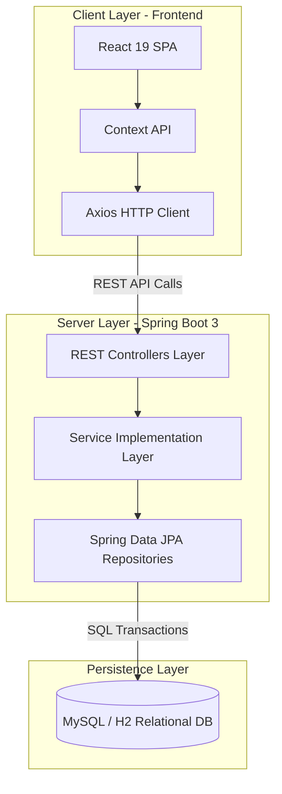
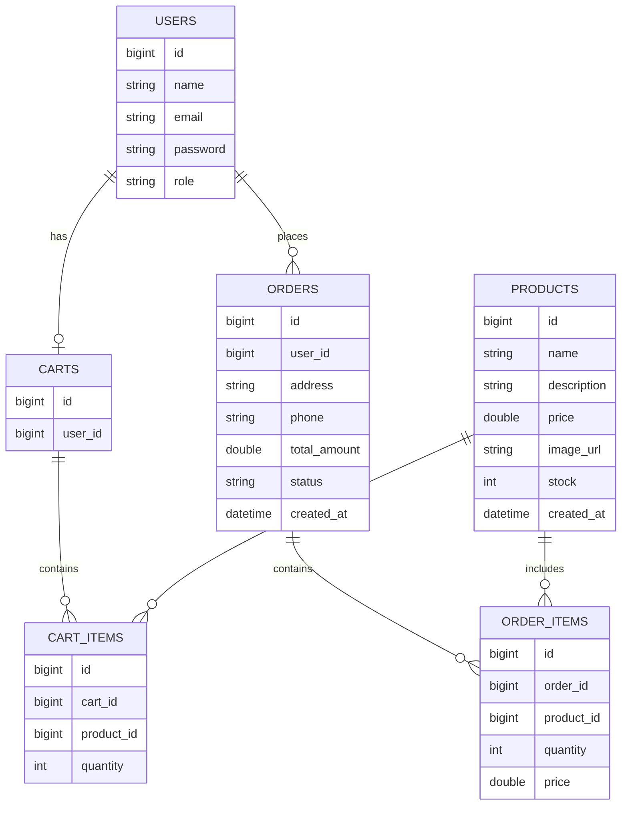

# 🛍️ Fashionify — Enterprise Full-Stack E-Commerce Platform

[](https://www.oracle.com/java/)
[](https://spring.io/projects/spring-boot)
[](https://react.dev/)
[](https://vitejs.dev/)
[](https://tailwindcss.com/)
[](https://www.mysql.com/)
[](LICENSE)

**Fashionify** is a production-grade, enterprise-ready full-stack e-commerce application engineered with **Spring Boot 3** on the backend and **React 19 (Vite)** on the frontend. The platform implements zero-trust backend security validation, stateful `HttpSession` session authentication, granular Role-Based Access Control (RBAC), atomic database inventory transactions, and a modern responsive user interface.

---

## 🚀 Executive Summary

Fashionify provides a complete end-to-end e-commerce solution designed around modern web engineering principles:

- **Zero-Trust Security:** Client inputs (prices, sub-totals, stock availability) are untrusted. All calculations and stock subtractions occur authoritatively in the backend database.
- **Role-Based Routing:** Strict route guards (`guestOnly`, `requireUser`, `adminOnly`) protect frontend views and backend REST controllers.
- **Atomic Transactions:** Order placement verifies available stock, creates order records, and deducts product stock inside isolated JPA transaction boundaries (`@Transactional`).
- **Session Cookie Architecture:** Uses native HTTP-only `JSESSIONID` cookies with CORS credentials sharing (`withCredentials: true`), removing the need for vulnerable localStorage token storage.

---

## 🏗 System Architecture & Data Flow



---

## ✨ Key Features

### Customer Storefront Engine

- **Product Discovery:** Responsive grid view with live currency formatting in Indian Rupee (`₹`).
- **Real-Time Stock Status:** Visual stock indicators (_In Stock (N)_ vs _Sold Out_ badge).
- **Cart Management:** Persistent backend shopping cart with quantity controls (`+` / `-` / remove), powered by React `CartContext`.
- **Checkout & Validation:** Clean checkout form with strict input filtering (10-digit numeric phone format limit).
- **Order Tracking:** Order history view showing order date, delivery address, item thumbnails, unit prices, and status updates.

### Admin Management Portal

- **Dashboard Overview:** Metric cards for Total Revenue, Total Orders, Pending Orders, Delivered Orders, and Active Products.
- **Product Inventory Management:** Full CRUD engine to create new products, update pricing ($> 0$) and stock ($\ge 0$), and delete items safely.
- **Order Fulfillment Pipeline:** Comprehensive order management interface to review customer details and advance status (`PLACED` $\rightarrow$ `SHIPPED` $\rightarrow$ `DELIVERED` or `CANCELLED`).

---

## 💻 Technical Stack Specification

### Backend Framework & Dependencies

| Library / Technology     | Version  | Purpose                               |
| :----------------------- | :------- | :------------------------------------ |
| **Java Development Kit** | JDK 21   | Target Execution Runtime              |
| **Spring Boot**          | 3.4.2    | Application Framework                 |
| **Spring Data JPA**      | 3.4.2    | ORM & Persistence Layer (Hibernate 6) |
| **Spring Validation**    | 3.4.2    | Declarative DTO Bean Validation       |
| **jBCrypt**              | 0.4      | Password Hashing with Salt            |
| **MySQL Connector**      | 9.1.0    | Relational Database Driver            |
| **H2 Database**          | Embedded | In-Memory Testing Database            |
| **Apache Maven**         | 3.9+     | Build & Dependency Management         |

### Frontend Framework & Dependencies

| Library / Technology | Version | Purpose                               |
| :------------------- | :------ | :------------------------------------ |
| **React**            | 19.0.0  | User Interface Library                |
| **Vite**             | 8.2.1   | Module Bundler & Dev Server           |
| **React Router DOM** | 7.1.5   | SPA Client-Side Routing               |
| **Axios**            | 1.7.9   | HTTP Client (`withCredentials: true`) |
| **Tailwind CSS**     | 4.0.0   | Utility-First Styling Framework       |
| **shadcn/ui**        | Latest  | Accessible UI Components              |
| **Lucide React**     | 0.475.0 | Modern Vector Icon Set                |

---

## 🔒 Security Architecture & Business Rules

### 1. Zero-Trust Business Validation

- **Price Calculation:** Client-sent price totals are ignored. Sub-totals and total amounts are calculated on the server using unit prices fetched directly from the database `Product` table.
- **Stock Validation:** Attempting to add or order items exceeding available stock triggers a `400 Bad Request` exception with a detailed error message.

### 2. Session Cookie Management

- Authentication relies on Spring `HttpSession`. Upon successful login, the server stores `userId` and `role` attributes in the active HTTP session.
- Session IDs are automatically synchronized between the Vite dev server (`localhost:5173`) and Spring Boot (`localhost:8080`) using `withCredentials: true`.

### 3. Route Guard Policy (`ProtectedRoute.jsx`)

- **`guestOnly={true}`**: Protects `/login` and `/register`. Logged-in users are redirected to `/` (Customers) or `/admin` (Admins).
- **`requireUser={true}`**: Protects `/cart`, `/checkout`, and `/my-orders`. Unauthenticated users are redirected to `/login`.
- **`adminOnly={true}`**: Protects `/admin/*`. Non-admin accounts are redirected to `/`.

## 🗄 Complete Database Schema (ER Model)



## 🔌 Exhaustive REST API Reference

### 1. Authentication API (`/api/auth`)

#### `POST /api/auth/register`

- **Access:** Public
- **Request Body:**
  ```json
  {
    "name": "Jane Doe",
    "email": "jane@example.com",
    "password": "securepassword123"
  }
  ```
- **Response (`200 OK`):**
  ```json
  {
    "id": 1,
    "name": "Jane Doe",
    "email": "jane@example.com",
    "role": "USER"
  }
  ```

#### `POST /api/auth/login`

- **Access:** Public
- **Request Body:**
  ```json
  {
    "email": "jane@example.com",
    "password": "securepassword123"
  }
  ```
- **Response (`200 OK`):**
  ```json
  {
    "id": 1,
    "name": "Jane Doe",
    "email": "jane@example.com",
    "role": "USER"
  }
  ```

#### `POST /api/auth/logout`

- **Access:** Authenticated Users
- **Response (`200 OK`):** `"Logged out successfully"`

#### `GET /api/auth/me`

- **Access:** Authenticated Users
- **Response (`200 OK`):** Current `UserResponse` object.

---

### 2. Product Catalog API (`/api/products`)

| Method   | Path                 | Auth   | Description                           |
| :------- | :------------------- | :----- | :------------------------------------ |
| `GET`    | `/api/products`      | Public | Retrieve all products in catalog      |
| `GET`    | `/api/products/{id}` | Public | Retrieve single product details by ID |
| `POST`   | `/api/products`      | Admin  | Create a new product catalog item     |
| `PUT`    | `/api/products/{id}` | Admin  | Update existing product details       |
| `DELETE` | `/api/products/{id}` | Admin  | Delete product from catalog           |

---

### 3. Cart API (`/api/cart`)

| Method   | Path                          | Auth     | Description                                      |
| :------- | :---------------------------- | :------- | :----------------------------------------------- |
| `GET`    | `/api/cart`                   | Customer | Fetch current customer's shopping cart           |
| `POST`   | `/api/cart/items`             | Customer | Add item to cart (`{ productId, quantity }`)     |
| `PUT`    | `/api/cart/items/{productId}` | Customer | Update item quantity (`{ productId, quantity }`) |
| `DELETE` | `/api/cart/items/{productId}` | Customer | Remove specific item from cart                   |
| `DELETE` | `/api/cart`                   | Customer | Clear all items from shopping cart               |

---

### 4. Order Management API (`/api/orders`)

#### `POST /api/orders`

- **Access:** Customer
- **Request Body:**
  ```json
  {
    "address": "123 Fashion Street, Suite 4B, Mumbai, MH 400001",
    "phone": "9876543210"
  }
  ```
- **Response (`200 OK`):**
  ```json
  {
    "id": 101,
    "totalAmount": 2499.0,
    "status": "PLACED",
    "createdAt": "2026-08-13T12:00:00",
    "address": "123 Fashion Street, Suite 4B, Mumbai, MH 400001",
    "phone": "9876543210",
    "items": [
      {
        "id": 1,
        "productId": 5,
        "productName": "Classic Denim Jacket",
        "productImage": "https://example.com/jacket.jpg",
        "quantity": 1,
        "price": 2499.0
      }
    ]
  }
  ```

| Method | Path                      | Auth     | Description                                   |
| :----- | :------------------------ | :------- | :-------------------------------------------- |
| `GET`  | `/api/orders/my`          | Customer | Retrieve customer's personal order history    |
| `GET`  | `/api/orders`             | Admin    | Retrieve all customer orders across store     |
| `PUT`  | `/api/orders/{id}/status` | Admin    | Update order status (`{ status: "SHIPPED" }`) |

---

## 🚀 Getting Started & Installation

### Prerequisites

- **Java JDK:** Version 21
- **Node.js:** Version 18.x or higher
- **MySQL Server:** Version 8.0 or higher
- **Apache Maven:** Version 3.9+ (or included `./mvnw` wrapper)

---

### Step 1: Database Initialization

1. Start your local MySQL server.
2. Launch your MySQL client and execute:
   ```sql
   CREATE DATABASE fashionify;
   ```

---

### Step 2: Backend Configuration & Execution

1. Open `backend/src/main/resources/application.properties`.
2. Configure your MySQL credentials:
   ```properties
   spring.datasource.url=jdbc:mysql://localhost:3306/fashionify?useSSL=false&serverTimezone=UTC&allowPublicKeyRetrieval=true
   spring.datasource.username=root
   spring.datasource.password=YOUR_MYSQL_PASSWORD
   spring.jpa.hibernate.ddl-auto=update
   spring.jpa.show-sql=true
   ```
3. Navigate to the `backend` folder and run Spring Boot:
   ```bash
   cd backend
   ./mvnw clean spring-boot:run
   ```
   The backend server will start at **`http://localhost:8080`**.

---

### Step 3: Frontend Installation & Execution

1. Navigate to the `frontend` directory:
   ```bash
   cd frontend
   ```
2. Install npm dependencies:
   ```bash
   npm install
   ```
3. Start the Vite development server:
   ```bash
   npm run dev
   ```
4. Access the store in your browser at **`http://localhost:5173`**.

---

## ❓ Troubleshooting & FAQ

#### 1. Cart operations return `400 Bad Request` ("Product ID is required")

Ensure `productId` is explicitly sent inside the request payload body for `PUT /api/cart/items/{productId}` (e.g. `{ productId: 1, quantity: 2 }`).

#### 2. Session cookie (`JSESSIONID`) is not stored on frontend

Verify that Axios requests use `withCredentials: true` and that Spring Boot `@CrossOrigin` explicitly allows `"http://localhost:5173"` with `allowCredentials = "true"`.

#### 3. Logged in Admin redirected away from customer store pages

By design, Admin accounts are restricted to the `/admin` control dashboard. Log out or log in with a customer account (`USER` role) to browse the storefront.

---

Developed with ❤️ by the **Fashionify Development Team**.
